<p align="center">
  
</p>

<h1 align="center">Satellite Data Search and Overpass Forecast Toolkit</h1>

<p align="center">
  <a href="https://doi.org/10.5281/zenodo.22837461"></a>
  
  
  
  
  
</p>

An end-to-end toolkit for finding, reviewing, and downloading satellite imagery over an area of interest (AOI), plus tools for planning field data collection around future satellite passes.

Covers **Sentinel-1, Sentinel-2, Landsat 8/9, NISAR, MODIS, and Sentinel-6**, pulling each product from wherever it actually lives — [Google Earth Engine](https://earthengine.google.com/) for what's in its catalog, and each mission's real archive (ASF DAAC, LP DAAC, PO.DAAC via [NASA CMR](https://cmr.earthdata.nasa.gov/)) for what isn't.

Two equivalent ways to use it:
- **An all-in-one interactive dashboard** ([app.py](app.py), built with [Streamlit](https://streamlit.io/))
- **Six numbered Jupyter notebooks**, one per pipeline stage

Both are backed by the exact same underlying code (`sat_search.py`, `sat_download.py`, `sat_forecast.py`, `sat_orbit.py`, `aoi_export.py`) — there's one implementation of each step, not two.

<p align="center">
  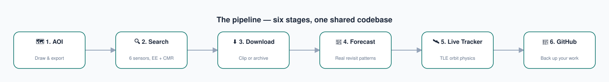
</p>

## Quick start

```bash
git clone https://github.com/SAY70/satellite-data-search.git
cd satellite-data-search
pip install -r requirements.txt
streamlit run app.py
```

**First time?** You'll need your own free Google Earth Engine project, and optionally a NASA Earthdata login for downloads. **[docs/pdf/00_Getting_Started.pdf](docs/pdf/00_Getting_Started.pdf) walks through the whole setup in about 10 minutes**, with no OAuth code to copy/paste.

Every pipeline stage also has its own short PDF guide in [docs/pdf/](docs/pdf/), and is one click away from inside the app (📖 icon on every tab).

---

## See it in action

Real output from a live run over a test AOI near Starkville, Mississippi — 392 scenes found across 4 sensors, filtered down to 181:

<p align="center">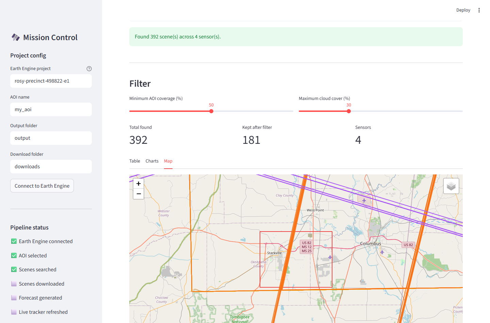</p>

---

## The six stages

### 🗺️ 1. AOI Selection

Draw an area of interest on an interactive map — rectangle or polygon, one shape — and export it as GeoJSON, KML, and KMZ. Every later stage reads the same GeoJSON back in.

<p align="center">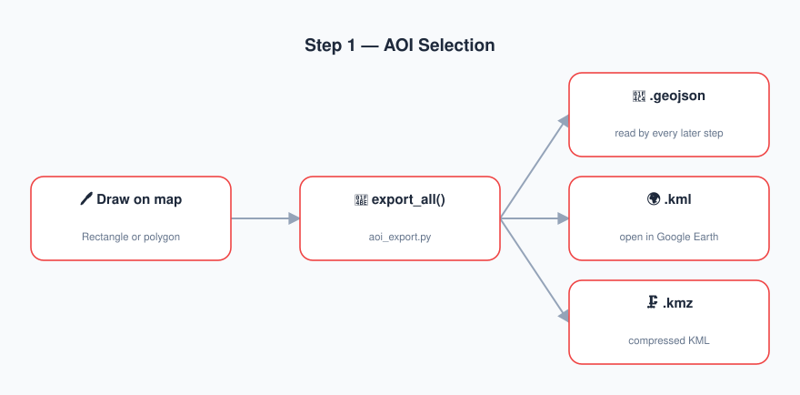</p>

<p align="center">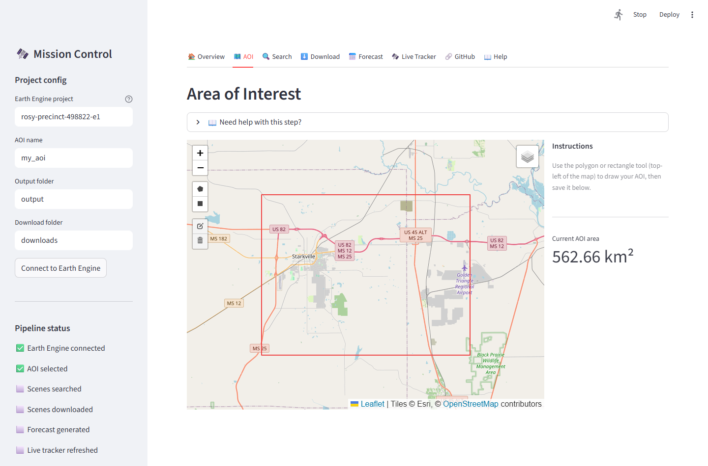</p>

### 🔍 2. Multi-Mission Search

Searches all six sensors over your AOI and date range in one pass, pulling each from wherever it actually lives, and merges everything into one filterable table with coverage %, cloud cover, resolution, and a footprint map.

<p align="center">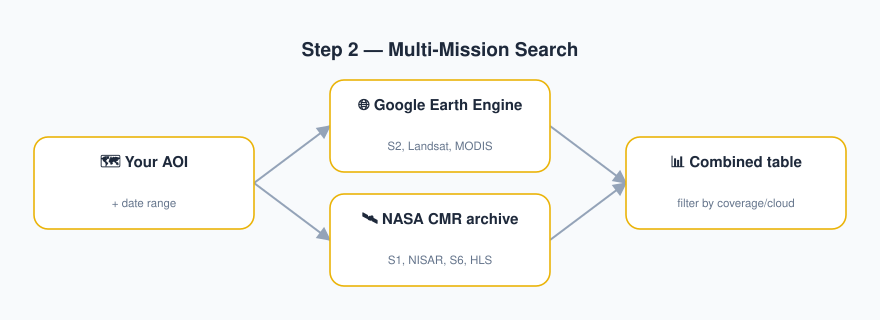</p>

Every product variant is queried separately, so you can see exactly what each mission did and didn't collect:

<p align="center">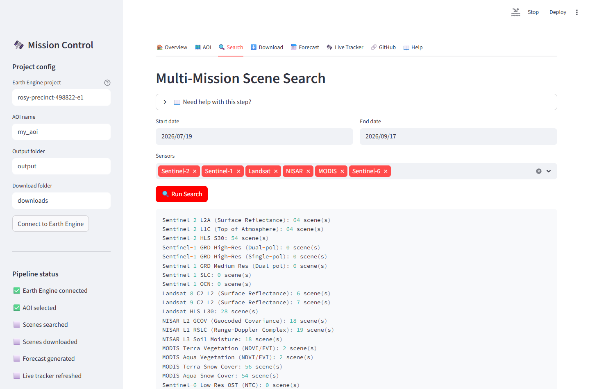</p>

Results land in a sortable table with everything you need to filter on, and export to CSV:

<p align="center">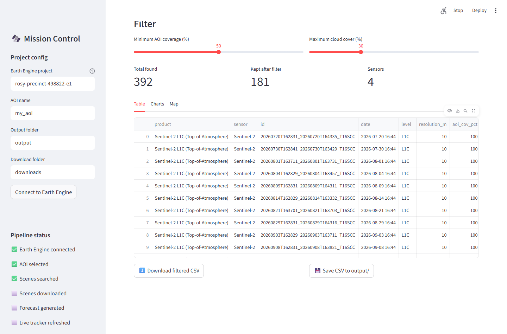</p>

### ⬇️ 3. Download

Pulls the scenes you kept. Earth Engine-sourced products are clipped to your AOI (small, no login); CMR-sourced products (Sentinel-1, NISAR, Sentinel-6, HLS) come from their real archive as full files, and need a free NASA Earthdata login.

<p align="center">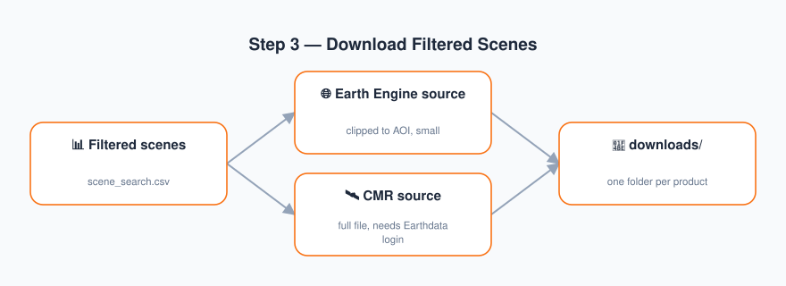</p>

### 📅 4. Future Overpass Forecast

Rather than assuming each satellite's textbook nominal revisit cycle, this looks at ~60 days of *actual* recent acquisitions over your specific AOI, detects the real repeating gap pattern, and projects it forward.

<p align="center">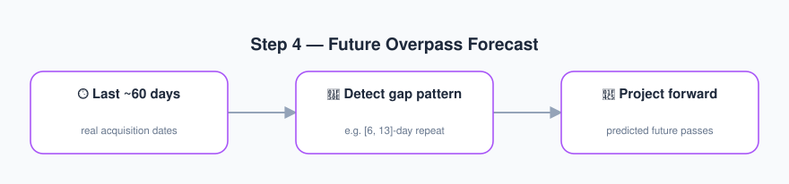</p>

Each platform's predicted passes, 90 days out — note how MODIS is near-daily while Landsat and Sentinel-2 cluster on their own repeat cycles:

<p align="center">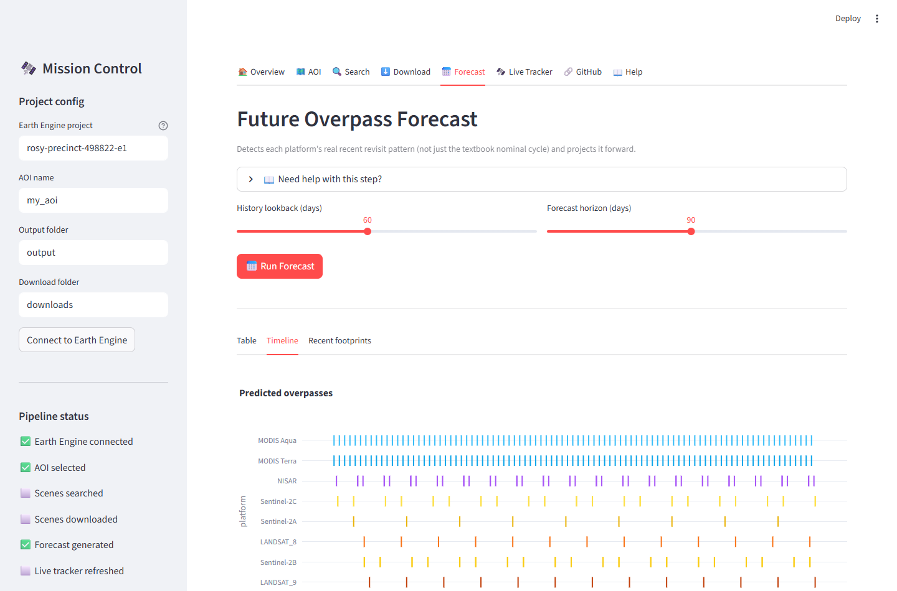</p>

### 🛰️ 5. Live Orbit Tracker

An independent, physics-based cross-check: pulls each satellite's live orbital elements (TLEs) from CelesTrak and propagates them forward with `skyfield` — no Earth Engine, no login, no acquisition history needed.

<p align="center">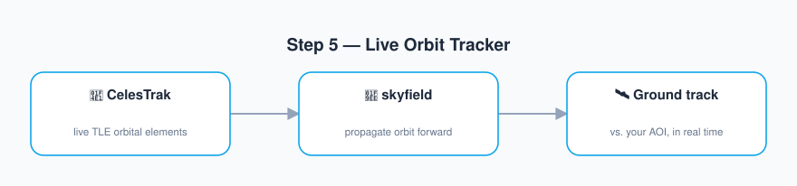</p>

<p align="center">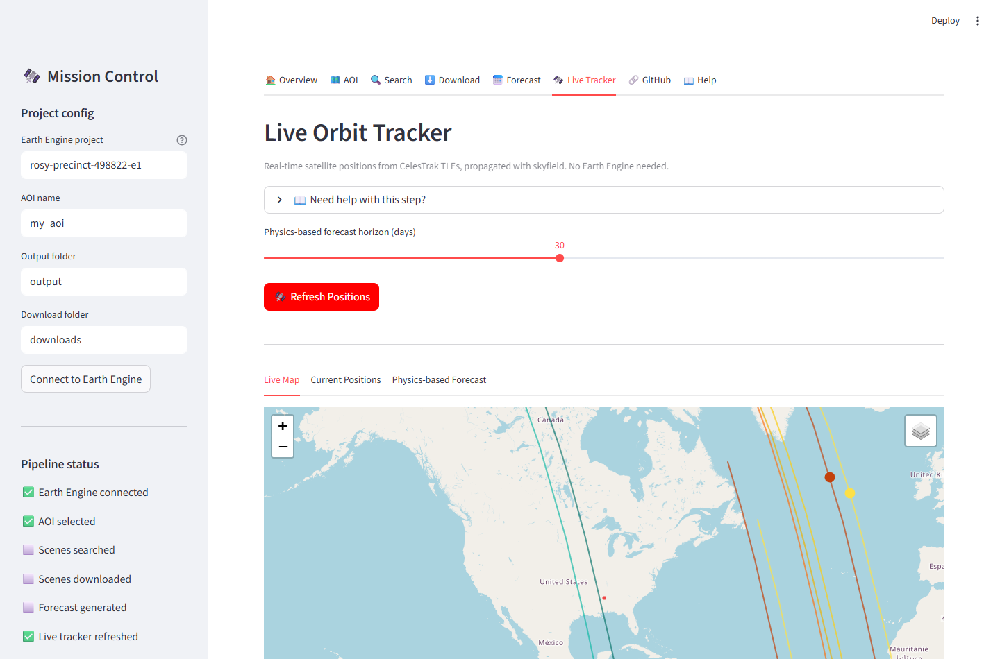</p>

### 🔗 6. GitHub Sync

Backs up the project to your own private GitHub repository — creating it automatically the first time, and only committing/pushing when something actually changed. `downloads/` is never pushed (a filename+size manifest is committed instead).

<p align="center">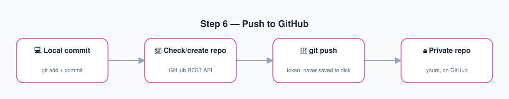</p>

---

## Why the empirical forecast?

Rather than assuming each satellite's textbook nominal revisit cycle (10 days for Sentinel-2, 16 for Landsat, etc.), the forecast step looks at the last ~60 days of *actual* acquisitions over your specific AOI and detects the real repeating gap pattern — which can differ substantially from the nominal figure (e.g. an AOI in the overlap zone between two adjacent orbit paths gets imaged more often than the nominal cycle implies). The Live Orbit Tracker provides an independent, orbit-physics-based cross-check that doesn't depend on acquisition history at all.

## Running the notebooks instead

```bash
jupyter lab
```

Then run, in order: `1_AOI_Selection.ipynb` → `2_Sentinel_Search.ipynb` → `3_Download_Filtered_Scenes.ipynb` → `4_Future_Overpass_Forecast.ipynb` → `5_Live_Orbit_Tracker.ipynb` → (optional) `6_Push_To_GitHub.ipynb`.

## Project structure

```
app.py                    # Streamlit dashboard (all 6 stages in one UI)
sat_search.py             # Multi-mission search (Earth Engine + CMR)
sat_download.py           # Scene download (Earth Engine + CMR)
sat_forecast.py           # Empirical revisit-pattern forecasting
sat_orbit.py               # Live TLE-based orbit tracking
aoi_export.py               # AOI export/import (GeoJSON/KML/KMZ)
1-6_*.ipynb                  # Notebook version of each pipeline stage
docs/pdf/                    # Guide PDFs (source: docs/generate_guides.py)
docs/images/                 # README diagrams (source: docs/generate_diagrams.py)
```

## Requirements

Python 3.10+, and see [requirements.txt](requirements.txt). Free accounts needed: [Google Earth Engine](https://code.earthengine.google.com/register), [NASA Earthdata](https://urs.earthdata.nasa.gov/) (downloads only), [GitHub](https://github.com/) (optional, for the sync feature).

## Understanding the data

This toolkit finds and fetches scenes; these are where to learn what the pixels actually mean — band definitions, scaling factors, and QA bit flags.

**Earth Engine collections used**

| Product | Catalog page |
|---|---|
| Sentinel-2 L2A (Surface Reflectance) | [COPERNICUS/S2_SR_HARMONIZED](https://developers.google.com/earth-engine/datasets/catalog/COPERNICUS_S2_SR_HARMONIZED) |
| Sentinel-2 L1C (Top-of-Atmosphere) | [COPERNICUS/S2_HARMONIZED](https://developers.google.com/earth-engine/datasets/catalog/COPERNICUS_S2_HARMONIZED) |
| Landsat 8 C2 L2 | [LANDSAT/LC08/C02/T1_L2](https://developers.google.com/earth-engine/datasets/catalog/LANDSAT_LC08_C02_T1_L2) |
| Landsat 9 C2 L2 | [LANDSAT/LC09/C02/T1_L2](https://developers.google.com/earth-engine/datasets/catalog/LANDSAT_LC09_C02_T1_L2) |
| MODIS Terra / Aqua Vegetation | [MOD13Q1](https://developers.google.com/earth-engine/datasets/catalog/MODIS_061_MOD13Q1) · [MYD13Q1](https://developers.google.com/earth-engine/datasets/catalog/MODIS_061_MYD13Q1) |
| MODIS Terra / Aqua Snow Cover | [MOD10A1](https://developers.google.com/earth-engine/datasets/catalog/MODIS_061_MOD10A1) · [MYD10A1](https://developers.google.com/earth-engine/datasets/catalog/MODIS_061_MYD10A1) |

**Archive-sourced products**

- **Sentinel-1** — [SentiWiki mission docs](https://sentiwiki.copernicus.eu/web/s1-mission) (GRD vs SLC, IW mode, polarization)
- **NISAR** — [ASF NISAR documentation](https://asf.alaska.edu/nisar/) (GCOV, RSLC, and the provisional data tier)
- **HLS** — [HLSS30 v2](https://lpdaac.usgs.gov/products/hlss30v002/) · [HLSL30 v2](https://lpdaac.usgs.gov/products/hlsl30v002/) (harmonized 30 m grid, Fmask bits)
- **Sentinel-6** — [PO.DAAC mission page](https://podaac.jpl.nasa.gov/Sentinel-6)

**Cross-checking a search**

If a sensor returns zero scenes and you want to confirm that's real rather than a bug, run the same AOI and dates through the mission's own web tool:

- [ASF Vertex](https://search.asf.alaska.edu/) — Sentinel-1 and NISAR
- [NASA Earthdata Search](https://search.earthdata.nasa.gov/) — anything CMR-hosted
- [CMR Search API docs](https://cmr.earthdata.nasa.gov/search/site/docs/search/api.html) — the API this toolkit queries
- [CelesTrak](https://celestrak.org/) and [skyfield](https://rhodesmill.org/skyfield/) — the TLE source and propagation library behind the Live Tracker

## Troubleshooting

Full details in **[docs/pdf/07_Troubleshooting.pdf](docs/pdf/07_Troubleshooting.pdf)** (also in the app's 📖 Help tab). The errors people hit most:

| Symptom | Cause and fix |
|---|---|
| `Cannot authenticate: Invalid request.` | Google retired the copy-paste OAuth flow. This toolkit uses `auth_mode="localhost"` — if you see this, you're on an older copy. |
| `ASFAuthenticationError: Failed to log in (401)` | Usually **not** a wrong password — authorize "Alaska Satellite Facility Data Access" at [your Earthdata apps](https://urs.earthdata.nasa.gov/profile/edit_applications), and use your Earthdata *username*, not your email. |
| A sensor returns 0 scenes | Often correct. Sentinel-1 is tasked (not automatic), Sentinel-6 is ocean-only, NISAR is early-mission. Cross-check on ASF Vertex or Earthdata Search. |
| `ensurepip ... non-zero exit status 1` on Windows | Path too long (260-char limit), often a OneDrive-synced folder. Create the venv somewhere short like `C:\venvs\sds`. |
| `401 Unauthorized` from `api.github.com` | Token expired, revoked, mistyped, or you used your password — GitHub stopped accepting passwords in 2021. |
| MODIS footprints cover the whole world | Expected — MODIS products here are global mosaics, so `aoi_cov_pct` is always ~100 and not a useful filter. |

## Tests

```bash
pip install -r requirements-dev.txt
pytest
```

70 tests covering the pure logic — revisit-pattern detection, scene filtering, CMR footprint parsing, download path handling, AOI export round-tripping — plus cross-module consistency checks. No network, Earth Engine session, or credentials required.

## Contributing

Bug reports, documentation fixes, and new sensors are all welcome — see [CONTRIBUTING.md](CONTRIBUTING.md) for how the code is organized and what it takes to add a mission.

## Security

Credentials are never written to disk by this toolkit. See [SECURITY.md](SECURITY.md) for how each credential is handled and how to report a vulnerability privately.

## Authors

| | Affiliation |
|---|---|
| **Suraj Yadav** ([0000-0002-0666-7629](https://orcid.org/0000-0002-0666-7629)) | Department of Agricultural and Biological Engineering, Mississippi State University |
| **Nuwan Wijewardane** ([0000-0001-8962-9451](https://orcid.org/0000-0001-8962-9451)) | Department of Agricultural and Biological Engineering, Mississippi State University |
| **Xin Zhang** | School of Environmental, Civil, Agricultural and Mechanical Engineering, University of Georgia |

## License

[GPL-3.0](LICENSE)

## Citing this work

Archived on Zenodo. Use the **concept DOI** to cite the software generally — it always resolves to the newest release:

> Yadav, S., Wijewardane, N., & Zhang, X. (2026). *Satellite Data Search and Overpass Forecast Toolkit*. Zenodo. https://doi.org/10.5281/zenodo.22837461

To cite **this exact version** (v1.0.0), use the version DOI instead: [10.5281/zenodo.22837462](https://doi.org/10.5281/zenodo.22837462).

Machine-readable metadata is in [CITATION.cff](CITATION.cff) — GitHub renders a "Cite this repository" button from it, and Zenodo reads it on each new release.
